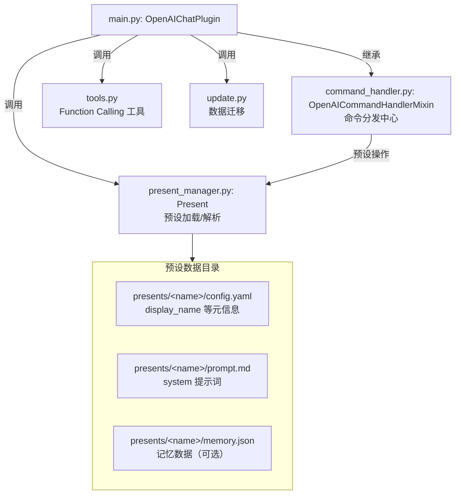
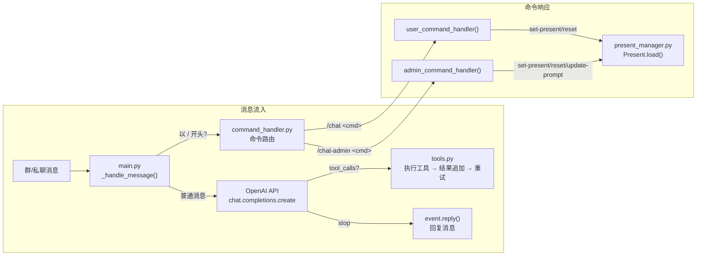
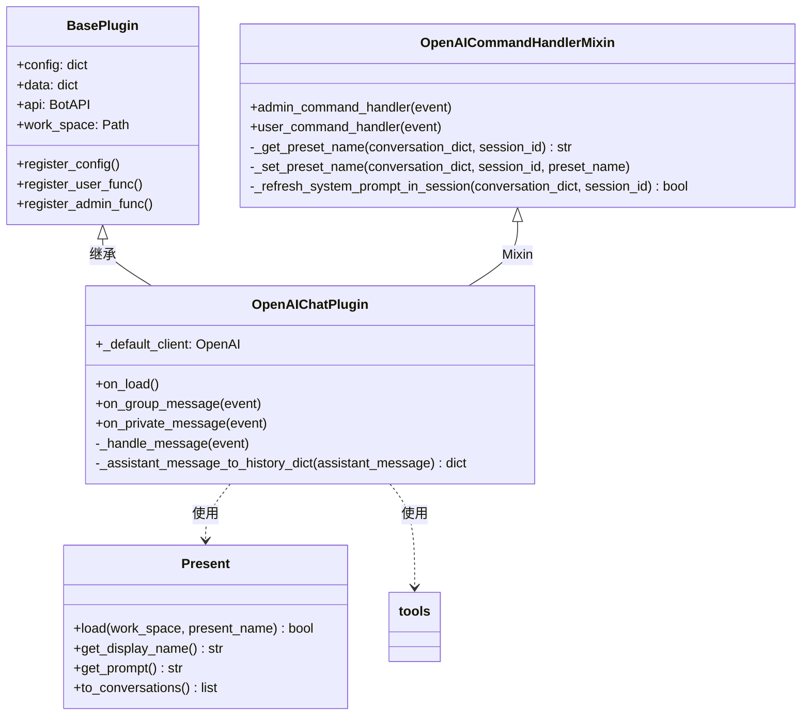
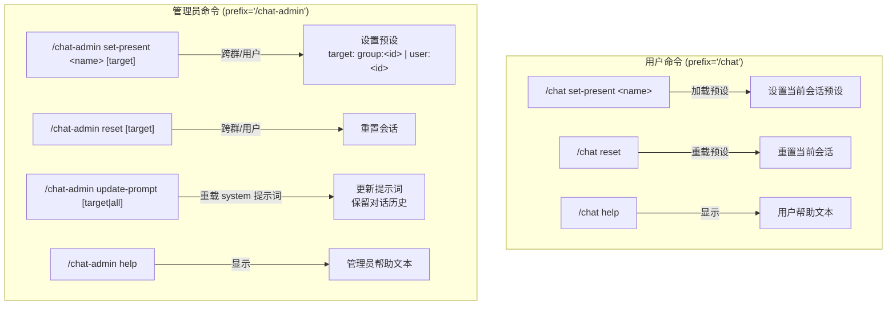

# openai_chat_plugin 插件架构与修改指南

## 概述

OpenAI 对话插件，通过 OpenAI API 实现智能对话，支持多预设管理、函数调用（Function Calling）、会话持久化。

## 文件结构

```
openai_chat_plugin/
├── __init__.py          # 导出 OpenAIChatPlugin
├── main.py              # 插件入口：配置注册、命令注册、消息处理、事件回调
├── command_handler.py   # 命令处理 Mixin：/chat 与 /chat-admin 的路由与业务逻辑
├── present_manager.py   # 预设管理：Present 类（config.yaml + prompt.md）
├── tools.py             # Function Calling 工具定义与实现（记忆、环境、网络等）
├── update.py            # 数据迁移：旧版全局配置 → presents/ 目录、记忆格式升级
├── exceptions.py        # 自定义异常（TooManyToolCallsException）
├── requirements.txt     # 依赖：openai, pyyaml
├── Pipfile              # Pipenv 依赖
└── README.md            # 用户文档
```

## 架构层次



## 数据流



## 类层级关系



## 命令速查



## 配置项

| 键 | 类型 | 默认值 | 说明 |
|----|------|--------|------|
| `ApiKey` | str | `sk-xxxxxxxx...` | OpenAI API Key |
| `Model` | str | `openai/gpt-4o-mini` | 使用的模型 |
| `BaseUrl` | str | `https://api.openai.com/v1` | API 基础 URL |
| `InsertUserdataAsPrefix` | bool | false | 在消息前添加用户名前缀 |
| `MustAtBot` | bool | true | 群聊必须 @ 机器人才能触发 |
| `EnableBuiltinFunctionCalling` | bool | false | 启用内置函数调用 |
| `AllowAccessMemory` | bool | false | 允许 AI 访问记忆（需启用函数调用） |
| `AllowWebRequests` | bool | false | 允许 AI 网络请求（需启用函数调用） |
| `MaxRetriesTimes` | int | 15 | 工具调用最大重试次数 |
| `IsConfigured` | bool | false | 插件是否已配置 |

配置通过 `self.register_config()` 注册，持久化在 `data/openai_chat_plugin/openai_chat_plugin.json`。

## 新增命令指南

1. **帮助文本** — 在 `command_handler.py` 顶部添加 `X_HELP_TEXT` 常量
2. **子命令处理器** — 在 `OpenAICommandHandlerMixin` 中添加 `async def handle_x_subcommand(event, command)`
3. **路由分发** — 在 `user_command_handler()` 或 `admin_command_handler()` 的 `if-elif` 链中添加新分支
4. **命令注册** — 如果使用新的前缀，在 `main.py` 的 `on_load()` 中用 `register_user_func()` / `register_admin_func()` 注册

## 新增预设工具指南

在 `tools.py` 中的 `tools` 列表添加工具定义时：

- 遵循 OpenAI Function Calling 格式（`type: "function"`, `function.name`, `function.description`, `function.parameters`）
- 在 `_handle_message()` 的工具分派 `if-elif` 链中添加对应的调用分支
- 如果工具需要权限控制，添加 `self.config['AllowXxx']` 检查
- 返回字符串结果，供模型继续生成回复

## 注意事项

- 预设目录结构：`presents/<present_name>/` 下包含 `config.yaml` 和 `prompt.md`
- `Present.to_conversations()` 返回 `[]`（空 prompt）或 `[{"role": "system", "content": "..."}]`
- `_handle_message()` 对以 `/` 开头的消息直接跳过，不调用 API
- 会话数据存储在 `self.data['data']` 中，由框架自动持久化
- 记忆功能需要 `AllowAccessMemory` 配置和 `EnableBuiltinFunctionCalling` 同时开启
- 数据迁移（`update.py`）在 `on_load()` 中自动执行，失败不阻塞加载
