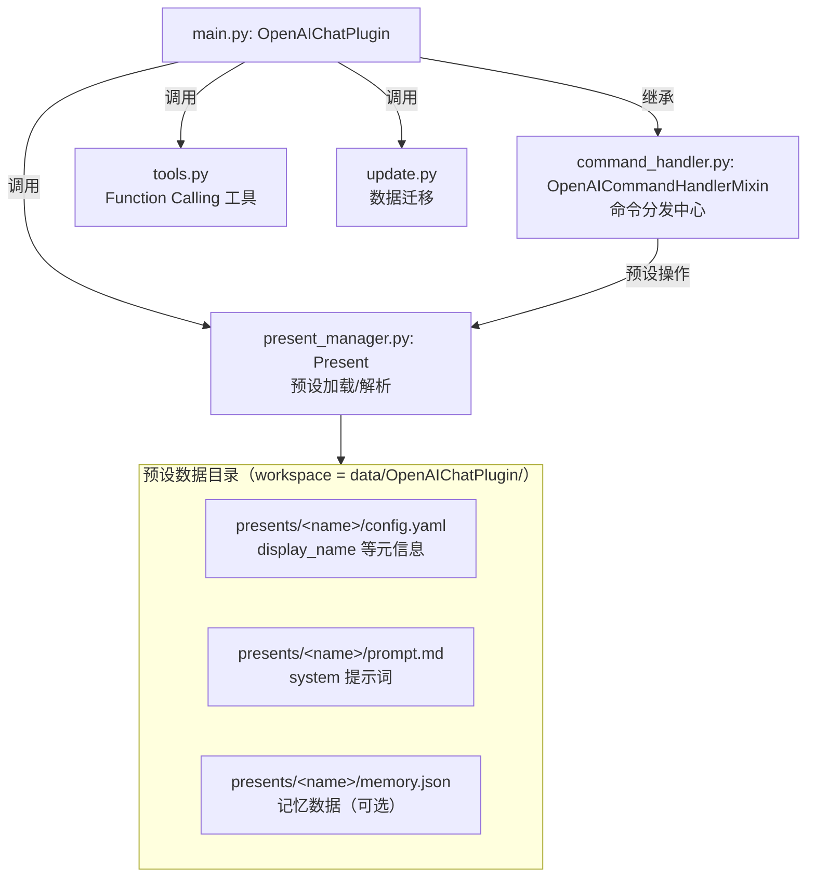
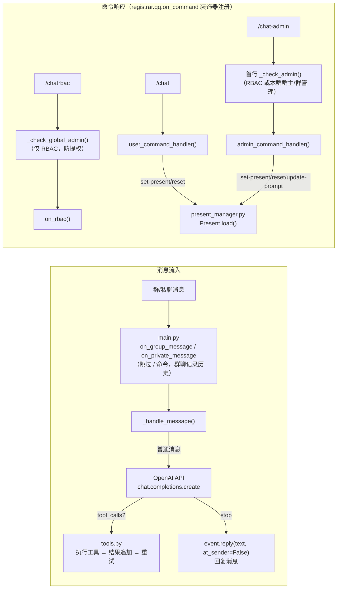
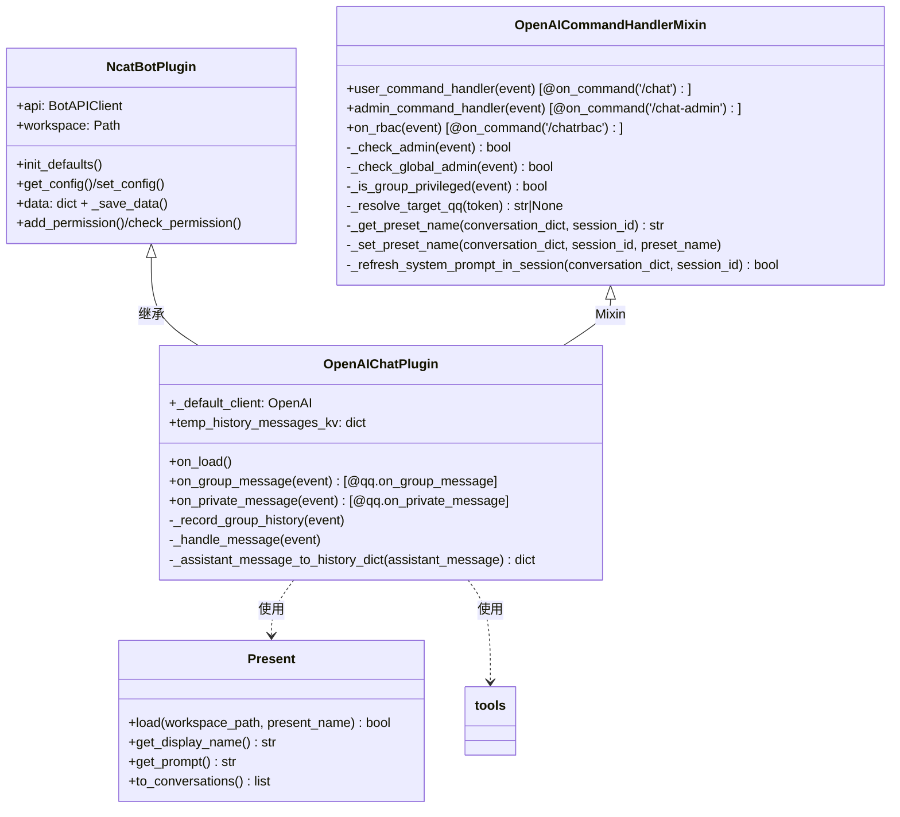

# OpenAIChatPlugin 插件架构与修改指南

## 概述

OpenAI 对话插件（NcatBot 5），通过 OpenAI API 实现智能对话，支持多预设管理、函数调用（Function Calling）、会话持久化、三层权限体系。

本插件为 git 子模块（`v5` 分支）——修改后必须在子模块目录内 `git commit`。

## 文件结构

```
OpenAIChatPlugin/
├── manifest.toml        # 插件清单（name/version/main/entry_class/pip_dependencies）
├── __init__.py          # 导出 OpenAIChatPlugin
├── main.py              # 插件入口：init_defaults、RBAC 注册、消息处理、事件回调
├── command_handler.py   # 命令 Mixin：/chat、/chat-admin、/chatrbac + 三层权限校验
├── present_manager.py   # 预设管理：Present 类（config.yaml + prompt.md）
├── tools.py             # Function Calling 工具定义与实现（记忆、环境、网络等）
├── update.py            # 数据迁移：4.x 工作区数据迁移、记忆格式升级
├── exceptions.py        # 自定义异常（TooManyToolCallsException）
├── requirements.txt     # 依赖：openai, pyyaml, beautifulsoup4, markdownify
├── tests/               # pytest 测试（PluginTestHarness + MockAdapter 离线驱动）
└── README.md            # 用户文档
```

## 架构层次


```mermaid
flowchart TB
    Main["main.py: OpenAIChatPlugin"]
    Main-->|"继承"|Cmd["command_handler.py: OpenAICommandHandlerMixin<br/>命令分发中心"]
    Main-->|"调用"|PM["present_manager.py: Present<br/>预设加载/解析"]
    Main-->|"调用"|Tools["tools.py<br/>Function Calling 工具"]
    Main-->|"调用"|Upd["update.py<br/>数据迁移"]

    Cmd-->|"预设操作"|PM

    subgraph Preset["预设数据目录（workspace = data/OpenAIChatPlugin/）"]
        Config["presents/&lt;name&gt;/config.yaml<br/>display_name 等元信息"]
        Prompt["presents/&lt;name&gt;/prompt.md<br/>system 提示词"]
        Memory["presents/&lt;name&gt;/memory.json<br/>记忆数据（可选）"]
    end

    PM-->Preset
```

## 数据流


```mermaid
flowchart LR
    subgraph In["消息流入"]
        MQ[群/私聊消息]-->Entry["main.py<br/>on_group_message / on_private_message<br/>（跳过 / 命令，群聊记录历史）"]
        Entry-->Handle["_handle_message()"]
        Handle-->|"普通消息"|AI["OpenAI API<br/>chat.completions.create"]
        AI-->|"tool_calls?"|Tools["tools.py<br/>执行工具 → 结果追加 → 重试"]
        AI-->|"stop"|Reply["event.reply(text, at_sender=False)<br/>回复消息"]
    end

    subgraph CmdFlow["命令响应（registrar.qq.on_command 装饰器注册）"]
        Cmd1["/chat"]-->UserCmd["user_command_handler()"]
        Cmd2["/chat-admin"]-->PermCheck["首行 _check_admin()<br/>（RBAC 或本群群主/群管理）"]-->AdminCmd["admin_command_handler()"]
        Cmd3["/chatrbac"]-->StrictCheck["_check_global_admin()<br/>（仅 RBAC，防提权）"]-->RbacCmd["on_rbac()"]
        UserCmd-->|"set-present/reset"|PM["present_manager.py<br/>Present.load()"]
        AdminCmd-->|"set-present/reset/update-prompt"|PM
    end
```

## 类层级关系


```mermaid
classDiagram
    class NcatBotPlugin {
        +init_defaults()
        +get_config()/set_config()
        +data: dict + _save_data()
        +api: BotAPIClient
        +workspace: Path
        +add_permission()/check_permission()
    }

    class OpenAICommandHandlerMixin {
        +user_command_handler(event) [@on_command('/chat')]
        +admin_command_handler(event) [@on_command('/chat-admin')]
        +on_rbac(event) [@on_command('/chatrbac')]
        -_check_admin(event) bool
        -_check_global_admin(event) bool
        -_is_group_privileged(event) bool
        -_resolve_target_qq(token) str|None
        -_get_preset_name(conversation_dict, session_id) str
        -_set_preset_name(conversation_dict, session_id, preset_name)
        -_refresh_system_prompt_in_session(conversation_dict, session_id) bool
    }

    class OpenAIChatPlugin {
        +_default_client: OpenAI
        +temp_history_messages_kv: dict
        +on_load()
        +on_group_message(event) [@qq.on_group_message]
        +on_private_message(event) [@qq.on_private_message]
        -_record_group_history(event)
        -_handle_message(event)
        -_assistant_message_to_history_dict(assistant_message) dict
    }

    class Present {
        +load(workspace_path, present_name) bool
        +get_display_name() str
        +get_prompt() str
        +to_conversations() list
    }

    NcatBotPlugin <|-- OpenAIChatPlugin : 继承
    OpenAICommandHandlerMixin <|-- OpenAIChatPlugin : Mixin
    OpenAIChatPlugin ..> Present : 使用
    OpenAIChatPlugin ..> tools : 使用
```

MRO: `OpenAIChatPlugin(OpenAICommandHandlerMixin, NcatBotPlugin)`。

## 命令速查

命令通过 `@registrar.qq.on_command('/xxx')` 在 `command_handler.py` 中独立注册（群+私聊均可触发，方法内用 `isinstance(event, GroupMessageEvent)` 判群）：

| 命令 | 权限 | 说明 |
|------|------|------|
| `/chat set-present <name>` | 所有人 | 设置当前会话预设 |
| `/chat reset` | 所有人 | 重置当前会话 |
| `/chat help` | 所有人 | 用户帮助 |
| `/chat-admin set-present <name> [group:\|user:<id>]` | 三层校验 | 跨群/用户设置预设 |
| `/chat-admin reset [group:\|user:<id>]` | 三层校验 | 跨群/用户重置会话 |
| `/chat-admin update-prompt [target\|all]` | 三层校验 | 重载 system 提示词（保留历史） |
| `/chatrbac grant\|revoke\|list <qq>` | **仅全局管理员** | 管理 RBAC 全局管理员 |

## 权限体系（三层）

管理员命令通过 RBAC 权限点 `OpenAIChatPlugin.admin` 管控：

1. **全局管理员**（RBAC，跨群）— `_check_global_admin()` → `self.check_permission(uid, ADMIN_PERMISSION)`
   - `config.yaml` 的 `root`（机器人 owner）在 `on_load()` 自动授权（幂等，随 `data/rbac.json` 持久化）
   - 其余管理员由 root 通过 `/chatrbac grant` 授予、`revoke` 撤销、`list` 查看
2. **群主/群管理自动放行**（本群）— `_is_group_privileged()`
   - `api.qq.query.get_group_member_list` 查 `role in ('owner','admin')`，带 300s TTL 缓存（`_group_role_cache`）
   - 受 `EnableGroupOwnerAutoAuth` 开关控制（默认开）
3. **默认拒绝** — RBAC 服务不可用一律拒绝（fail-closed）

`/chat-admin` 全部子命令走 `_check_admin()`（RBAC 或本群群管理）；`/chatrbac` 只走 `_check_global_admin()`（严格 RBAC，防群主提权）。

## 配置项

| 键 | 类型 | 默认值 | 说明 |
|----|------|--------|------|
| `ApiKey` | str | `sk-xxxxxxxx...` | OpenAI API Key |
| `Model` | str | `openai/gpt-4o-mini` | 使用的模型 |
| `BaseUrl` | str | `https://api.openai.com/v1` | API 基础 URL |
| `InsertUserdataAsPrefix` | bool | false | 在消息前添加用户名前缀 |
| `MustAtBot` | bool | true | 群聊必须 @ 机器人才能触发 |
| `EnableBuiltinFunctionCalling` | bool | false | 启用内置函数调用 |
| `AllowAccessMemory` | bool | false | 允许 AI 访问记忆（需启用函数调用） |
| `AllowWebRequests` | bool | false | 允许 AI 网络请求（需启用函数调用） |
| `MaxRetriesTimes` | int | 15 | 工具调用最大重试次数 |
| `MaxConversationCacheStoreAmount` | int | 1000 | 最大对话缓存存储数量 |
| `IsConfigured` | bool | false | 插件是否已配置 |
| `EnableGroupOwnerAutoAuth` | bool | true | 群主/群管理自动放行本群管理员命令 |

默认值在 `on_load()` 经 `init_defaults()` 注册（仅内存）；可被全局 `config.yaml` 的
`plugin.plugin_configs.OpenAIChatPlugin` 覆盖（高优先级）。写配置用 `self.set_config(key, value)`（立即持久化）。

## 数据持久化

- 会话数据存储在 `self.data['data']`（四个子字典：group/user_conversations、group/user_preset_names），
  由 DataMixin 自动持久化到 `<workspace>/data.json`；中途保存用 `self._save_data()`
- v5 事件中 `event.group_id` / `event.user_id` / `event.self_id` 均为 **str**，会话字典键统一为字符串

## 数据迁移（update.py）

- `migrate_legacy_workspace(plugin)`：一次性将旧版 `data/openai_chat_plugin/`（4.x 运行时数据）迁移到新位置
  （presents 整目录复制 + 旧 json `data` 键迁入 data.json），完成后旧目录改名 `.migrated.bak`；幂等，失败不阻塞加载
- `is_need_update` / `update_data`：legacy memory.json → v0.1.4+ 格式升级
- 4.x 时代依赖 `config.plugins_config` 的全局配置预设迁移已在 v5 中删除（API 不存在）

## 新增命令指南

1. **帮助文本** — 在 `command_handler.py` 顶部添加 `X_HELP_TEXT` 常量
2. **处理器** — 在 `OpenAICommandHandlerMixin` 中添加 `async def on_xxx(self, event: MessageEvent)`，
   解析参数用 `_parse_command(event)`（shlex 封装，失败自动回复"格式错误"）
3. **权限** — 管理员命令首行 `if not await self._check_admin(event): return`；
   授予/撤销全局权限类命令必须用 `_check_global_admin()`（防提权）
4. **注册** — 方法上加 `@registrar.qq.on_command('/xxx')`，无需在 main.py 额外注册

## 新增预设工具指南

在 `tools.py` 中的 `tools` 列表添加工具定义时：

- 遵循 OpenAI Function Calling 格式（`type: "function"`, `function.name`, `function.description`, `function.parameters`）
- 在 `_handle_message()` 的工具分派 `if-elif` 链中添加对应的调用分支
- 如果工具需要权限控制，添加 `self.get_config('AllowXxx')` 检查
- 返回 JSON 字符串结果（查询类 API 返回 pydantic model 时经 `_to_jsonable()` 转换）

## 测试要求

- 测试放 `tests/`，用 `ncatbot.testing.PluginTestHarness` + MockAdapter 离线驱动，
  文件必须 `pytestmark = pytest.mark.asyncio(mode="strict")`
- **必须隔离真实数据**：每个用例 `monkeypatch.chdir(tmp_path)`（RBAC `data/rbac.json` 与插件 workspace 均为相对路径）；
  `conftest.py` 已设置 `NCATBOT_CONFIG_PATH` 指向 `tests/ncatbot_test_config.yaml`（root=123456），
  禁止触碰真实 `config.yaml` / `data/`
- **会话预热夹具**：`conftest.py` 含 session 级 `_warm_first_plugin_load`（autouse）。因 pytest 会以
  无 loader 上下文方式提前导入插件包导致首个 harness 会话 handler 注册失效，预热先空载一次加载/卸载；
  新增用例无需关心此细节
- 运行（推荐在插件目录内执行）：`python -m pytest tests -v -o "addopts="`
  （仓库根目录 `.\.venv\Scripts\python -m pytest plugins/OpenAIChatPlugin/tests -o "addopts="` 亦可）
- 对话链路测试须替换 `plugin._default_client` 为 stub（见 `tests/fake_openai.py`），禁止真实网络请求

## 注意事项

- 预设目录结构：`<workspace>/presents/<present_name>/` 下包含 `config.yaml` 和 `prompt.md`
- `Present.to_conversations()` 返回 `[]`（空 prompt）或 `[{"role": "system", "content": "..."}]`
- `_handle_message()` 对以 `/` 开头的消息直接跳过，不调用 API
- 回复统一 `at_sender=False`（保留旧版不 @ 发送者的行为）
- 记忆功能需要 `AllowAccessMemory` 配置和 `EnableBuiltinFunctionCalling` 同时开启
- QQ API 一律经 `self.api.qq.*` 访问（如 `post_group_msg(group_id, text=...)`、`query.get_stranger_info(...)`）
